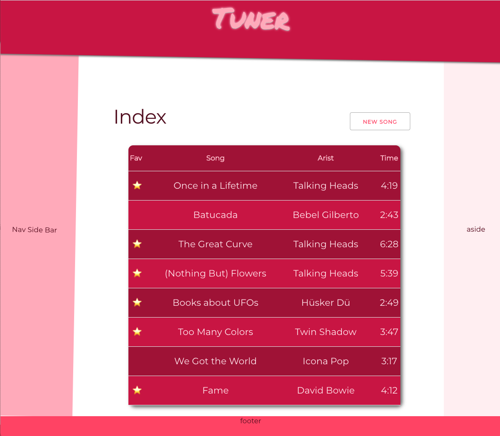
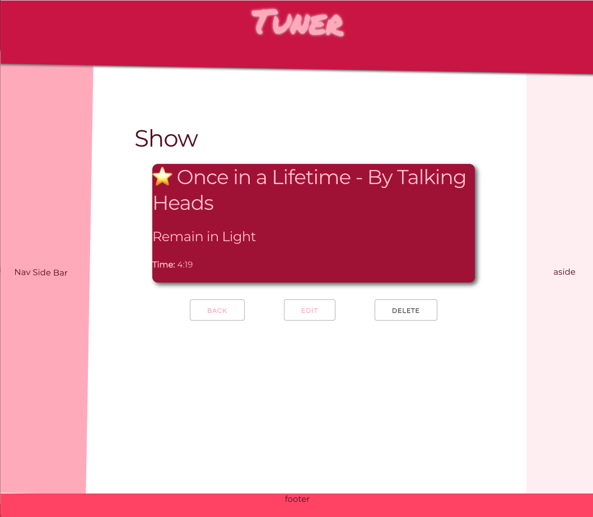
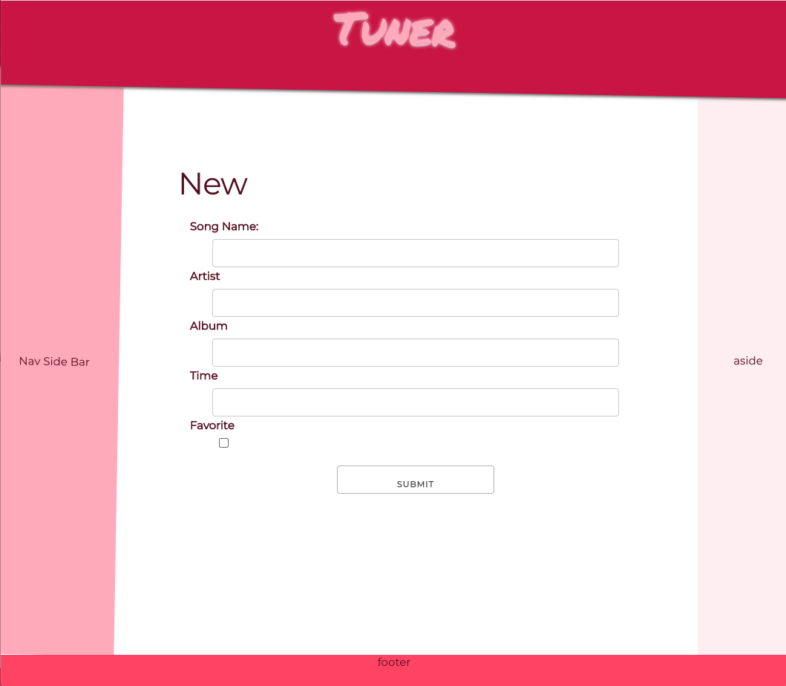
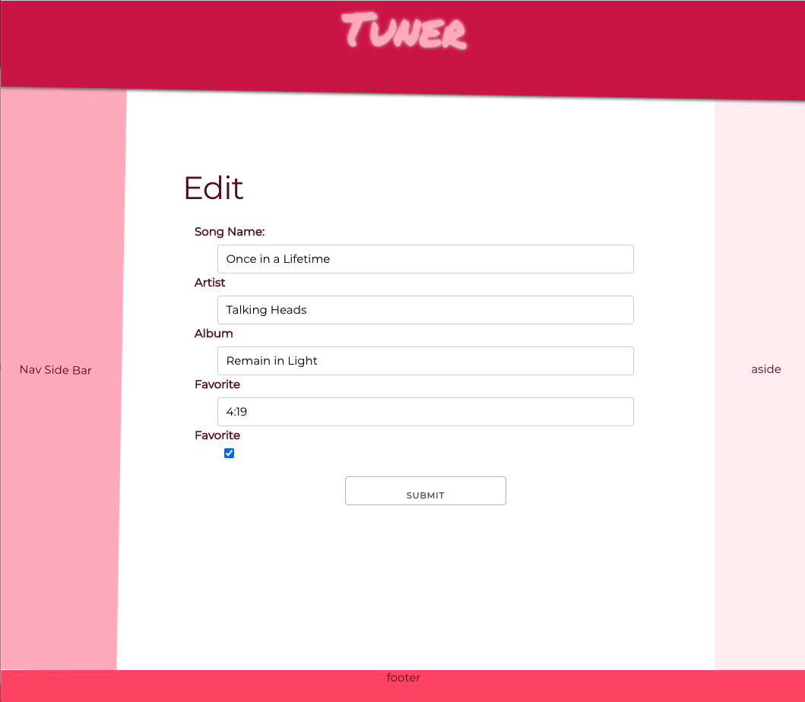

# tuner-react

# Tuner Front-End

## Getting Started

- Fork this repo
- Clone the forked repository
- `cd` to the directory where you cloned it
- `npx create-react-app tuner-front-end`
- `npm start` to start the react app on `localhost:3000`

> _Note_: Remember to `git add`, `git commit` and `git push` regularly

Using the [Tuner API that you built](https://github.com/joinpursuit/tuner-api/blob/main/README.md), you are going to create a frontend-only app.

Don't forget to keep your back-end API running during this build/

#### Nav Bar

At the top of your app you should have a navigation bar.

- It displays a links to the route (`/songs`) at the top of the page.

Your app should also include the following routes:

### `/songs`

- Displays a list of `song.title`, `song.is_favorite`, `song.artist` and `song.time` that are clickable to take the user to **`/songs/:id`** IMPORTANT - be sure it goes to the song's `id` **NOT** the array position. Since we are now using a database you should use the `id`.

Inspiration

**IMPORTANT**

Your page should

### `/songs/:index`

- Displays the details of each log
  - name
  - artist
  - album
  - is_favorite
  - time
- Displays two buttons
  - <kbd>back</kbd>, takes the user back to the `/songs` view
  - <kbd>delete</kbd>, deletes the log and takes the user back to the `/songs` view

**BONUS**

- button for `edit` - which takes the user to the edit form for this song

Inspiration

### `/songs/new`

- Displays a form with the following inputs and appropriate labels:

  - name (text)
  - artist (text)
  - album (text)
  - is_favorite (boolean)
  - time (text)

Inspiration

### Bonuses

- Add an edit route `/songs/:id/edit`
- Add an edit form that is pre-filled with the log to edit

Inspiration

- Style the app
- Use react-bootstrap
- Use react-transition-group to transition between pages [Demo](https://reactrouter.com/web/example/animated-transitions)
- write your own tests for the edit route
- add a 404 page
- add functionality that when a user presses the delete button a confirmation appears first
